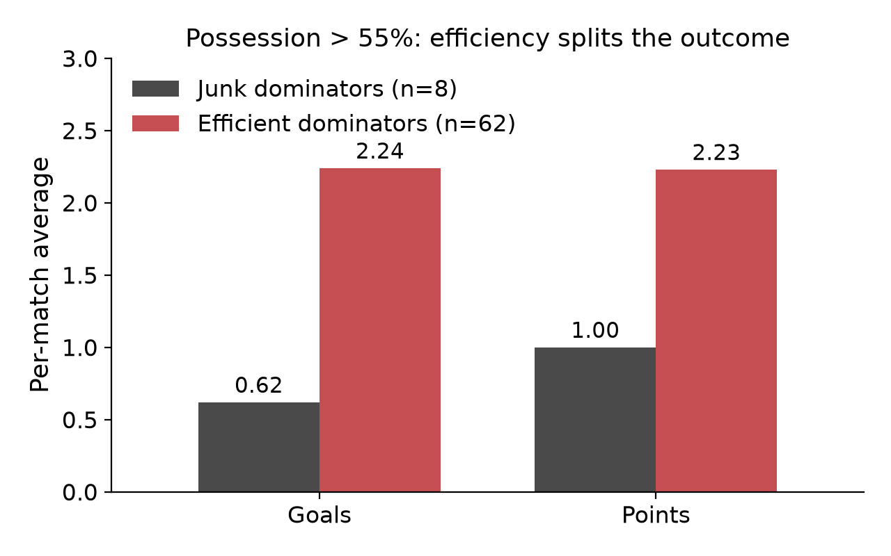
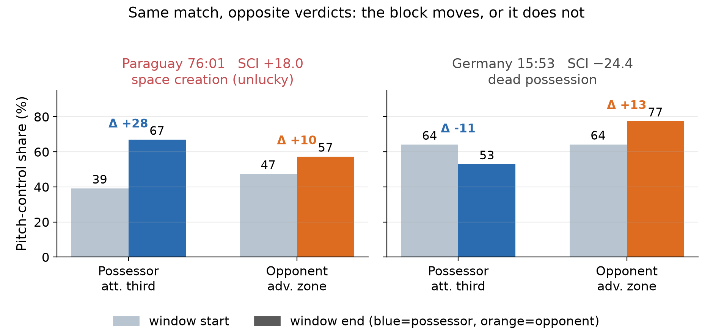

# Space-Creating versus Dead Possession

[](https://arxiv.org/abs/2608.09887)
[](https://doi.org/10.5281/zenodo.22015972)
[](LICENSE)

An off-ball **possession-quality** framework for football: separate *unlucky*
possession (that manufactured space it failed to convert) from *dead*
possession (that never moved the opponent's block) — a distinction event-only
on-ball possession value (EPV / VAEP / OBV) cannot make from its inputs alone.

Possession percentage is the most-cited and most-misleading number in the game.
Existing possession-value models price the **on-ball** action; the question a
sterile possession actually poses is **off-ball**: did holding the ball create
space?

We answer in two layers.

## Two layers

**1. Event-side junk-possession index.** Split possession into sequences, price
each by its peak threat gain (credited even without a shot) under an
expected-threat grid, and —
after reconstructing the live scoreline to drop lead-protecting circulation —
flag low-threat sequences in tied-or-losing game states (`junk-open`).

On the 2026 FIFA World Cup (103 matches, 206 team-matches):

| metric | Team xG | Goals | Points | xG diff |
|---|---|---|---|---|
| `junk-open` | −0.38 | −0.38 | **−0.37** | −0.51 |

Among teams above 55% possession, splitting by efficiency separates the outcome:



*Junk dominators (n=8): 0.62 goals, 1.00 points. Efficient dominators (n=63):
2.24 goals, 2.24 points (split by the **corpus-wide** median efficiency, not a
within-group split; eight observations, descriptive only).*

**Not a repackaging of on-ball value.** With team offensive VAEP and field tilt
held fixed in the same regression, `junk-open` stays strongly negatively
**associated** with points (p < 10⁻⁴, and under
match-clustered standard errors) while **VAEP itself is not significant** (p = 0.34). Despite a surface correlation of ~0.5
between VAEP and the junk metrics, conditional on the quality metric VAEP is not
a significant predictor — the index adds outcome-relevant information beyond this
on-ball action-value model. See `src/junk_cluster_se.py` for the clustered
re-estimation.

**2. Spatial Space-Creation Index (SCI).** For a flagged window, project
broadcast video to pitch coordinates and measure a **net two-zone pitch-control
change** — space seized high up and/or the opponent's block pushed back:

> SCI = Δ(possessor's attacking-third control) + Δ(opponent's advanced-zone collapse)
>
> (Δ_opp is defined as *collapse* = early − late, so a positive term means the
> opponent's deep control fell; SCI is the net of the two.)



*Two flagged junk windows from the same match (Germany–Paraguay, Round of 32),
opposite verdicts. Left: Paraguay seizes the attacking third (SCI +18.0). Right:
Germany is non-space-creating (SCI −24.4) — it lost attacking-third control while
Paraguay's block advanced; it held 73% of the ball and went out on penalties.*

Across 31 flagged windows from nine World Cup matches (a **purposive**
multi-match sample, not tournament-wide): **74% spatially non-space-creating, 19%
weak progression, 6% space-creating** windows the event flag alone would score as
failure. `junk` names the event-side candidate flag; SCI does not revise it but
subdivides each low-threat window as spatially dead, weakly progressing, or
space-creating.

## Repository layout

```
src/
  junk_possession.py   # the index: sequence value, junk-open, score-state normalisation
  junk_rank.py         # corpus-wide ranking (per-tournament)
  junk_validate.py     # validation: correlations, weight learning, partial regression,
                       #             VAEP non-reducibility, out-of-sample, redemption
  junk_cluster_se.py   # match-clustered (CR1) robust SE for the headline regressions
  space_signature.py   # Space-Creation Index from projected spatial series
paper/
  latex/main.tex       # the paper (arXiv source) + refs.bib + figures
  possession_quality_EN.md / _KO.md   # summaries
figures/               # figures used in the README and paper
```

## Companion work

The spatial layer runs on broadcast footage, where only 10–16 of 22 players are
visible. The off-screen imputation it depends on is the subject of a companion
paper — **Training-Free Off-Screen Player Imputation for Broadcast-Based Spatial
Football Analytics**:
[arXiv:2607.11548](https://arxiv.org/abs/2607.11548) ·
[code](https://github.com/nowayfootball/offscreen-impute) ·
[10.5281/zenodo.21327945](https://doi.org/10.5281/zenodo.21327945).

## Reproducibility and data

The event-side index, validation battery (including the VAEP non-reducibility
regression and its match-clustered re-estimation), and tournament aggregation run on CPU. The **event corpus**
(WhoScored-derived) and the **broadcast footage** used for the spatial layer are
**not redistributable**, so the scripts here are released as the reference
implementation described in the paper rather than a turnkey pipeline; they depend
on an event store and, for SCI, on projected spatial series produced by a
broadcast GSR pipeline. No GPU or cloud expenditure was used for any experiment.

The VAEP baseline is our own implementation of Decroos et al. (2019); `xT`
follows Karun Singh's expected-threat grid.

## Citation

Paper: *Space-Creating versus Dead Possession: An Off-Ball Possession-Quality
Index for Broadcast Football* — Seongjin Choi, 2026.
[arXiv:2608.09887](https://arxiv.org/abs/2608.09887) ·
archived code [10.5281/zenodo.22015972](https://doi.org/10.5281/zenodo.22015972)
(concept DOI, always resolves to the latest release).

```bibtex
@article{choi2026spacecreating,
  title  = {Space-Creating versus Dead Possession: An Off-Ball Possession-Quality
            Index for Broadcast Football},
  author = {Choi, Seongjin},
  year   = {2026},
  eprint = {2608.09887},
  archivePrefix = {arXiv},
  primaryClass  = {cs.CV}
}
```

Machine-readable metadata is in `CITATION.cff`.

## License

MIT (`LICENSE`).
